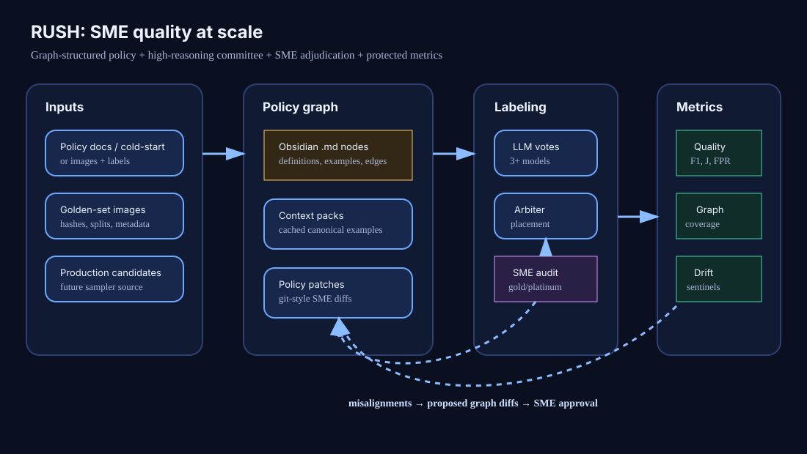

# RUSH

**Reinforcement learning Using SME feedback and High-reasoning models** — an enterprise auto-judge that delivers **human-quality judgment at machine cost**.

Every trust, quality, and relevance team pays for the same thing: expert decisions at production scale. Today that is bought with redundant human review — panels of outsourced annotators (business-process outsourcing, BPO) checked by scarce subject-matter experts (SMEs). RUSH takes the guideline the policy team already writes and turns it into a production judge — and measures, in dollars and decision quality, that it works. It buys the same judgment with a **three-tier escalation cascade**: cheap models label everything and agree on the easy majority; only genuine disagreement escalates to a high-reasoning model; only what reasoning cannot resolve reaches a human SME. And the system *improves as it runs*: the judging policy is a versioned, human-readable knowledge graph, tuned by an RLHF-style loop where SME feedback is the reward signal — so decision quality grows with every accepted policy version while cost per decision falls. Economically, the cascade is a cost curve:

> **Spend reasoning only where cheap consensus fails. Spend humans only where reasoning fails.**



---

## The three-minute version

**1. The product.** An auto-judge for Trust & Safety, content quality, search relevance, and ads relevance: it scales one SME's decision quality to production volume, keeps the resulting metric honest as policy and content drift, and hands the policy itself back to the humans who own it as a readable, versioned document graph. The in-repo demos (GenAI-image detection, MNIST digits) are toy proofs of the loop; the target workload is a 50-page Adult-Content policy or a cold-started PII policy.

**2. The tokenomics.** Judgment is priced in three currencies — cheap tokens, reasoning tokens, SME minutes — and the cascade is the allocator that buys maximum decision quality per dollar:

| Tier | Who | Handles | Measured in this repo (MNIST cascade run, 400 images) |
|---|---|---|---|
| **1 — Cheap consensus** | 5-model low-cost panel (GPT-5.4-mini low, Haiku 4.5 low, Gemini flash-lite, + 2 free local models) | The whole stream | 2,000 calls attempted, 1,920 completed (80 errored; the run finalized completed-with-errors), 1,477s wall; ensemble **97.7% accuracy**, **0.25% FPR**; resolved 258/400 outright, all correct in this run — costs in the box below |
| **2 — High-reasoning judge** | Claude Sonnet 5, adaptive thinking | Only escalations: split votes, ties, abstains, ≥2 hedging voters | **142/400 = 35.5%** escalated; re-judged with the same policy graph |
| **3 — Human SME** | Adjudication queue | Only what tier 2 leaves unresolved (including errored calls — they fall through honestly, never vanish) | Boundary residual only |

The escalation trigger is unit-tested and panel-size-aware. In the measured run, single-hedger flags proved pure noise (98/98 had correct majorities), so they *don't* escalate — the trigger spends tier-2 tokens only on real ambiguity.

**3. The learning loop (RLHF where the prompt is the policy).** The labeling prompt is not prose — it is a compiled, versioned **policy graph**. Tuning it is proximal policy optimization over a document: the prompt is the policy π, SME labels are the reward signal, each guideline edit is one gated, clipped textual-gradient step, and the golden set is a *maintained* reward model. The design target is decision quality on held-out data that is non-decreasing over accepted edits; an SME approves every diff today — the automated held-out DQ gate is the next wiring step (see [the RLHF mapping](#the-rlhf-mapping--the-prompt-is-the-policy-an-analogy)).

**4. The honest economics.** Every dollar figure in this README lives in the measured-vs-illustrative box directly below, and each is labeled either *measured in this repo* or *illustrative at Pinterest scale* (exec-brief targets and internal pilot figures, not repo measurements). Read the box before quoting any number.

---

## Measured vs illustrative — read the numbers correctly

**Measured in this repo** (MNIST cascade run `20260706T042415-1b258772`, split=all, 400 images):

- Tier-1 panel: 2,000 calls attempted, 1,920 completed for **$4.28 hosted cost** (80 errored; the run finalized completed-with-errors — the honesty semantics working as designed); ~**$2.23 per 1,000 completed labels**; 1,477s wall
- Ensemble decision quality: **97.7% accuracy** on the 400-image run (396 of 400 had a decisive majority; 387/396 correct), **97.7% macro recall, 0.25% macro & micro FPR**
- Escalation: **142/400 = 35.5%**; the 258 cheap-resolved images were **100.0% correct** — on a saturated toy task, n=258: treat as a trigger-validation result, ~98.6% lower bound, not a guarantee
- Single-hedger boundary flags: 98/98 correct majorities (pure noise → correctly not escalated)
- **458 tests pass (461 collected, 3 skipped)**; consensus layer, escalation trigger, and SME fall-through unit-tested
- Tier-2 accuracy on the escalated set is deliberately **not quoted** — mechanics are shipped; measured numbers land with the next scored cascade run

**Illustrative at Pinterest scale** (from exec strategy material — targets and internal pilot figures, not repo measurements):

- 3× BPO baseline: roughly **$0.71/image all-in under 3× BPO redundancy** (exec-brief figure, illustrative) → **$710K per 1M-image eval set**, ~2,500 human hours, multi-week latency (illustrative)
- RUSH target (illustrative): **<$71K per 1M** with a single frontier model; **<1/50 cost** with prompt caching; **orders-of-magnitude faster turnaround** (~24h vs multi-week BPO cycles)
- **85.7% consensus accuracy** on the Adult-Content pilot — an internal pilot figure, measured against an internal 3× BPO baseline that is not reproduced here
- Golden-set overturn rates from internal re-adjudication (internal pilot figures): **33% (Trust) / ~50% (content quality, search relevance)**

---

## The policy graph is the product

RUSH is built for the people who own the *policy*, not the people who own the GPUs. The artifact it optimizes is not a model checkpoint — it is a **knowledge graph of the policy itself**, written as Obsidian-style Markdown that policy managers, legal partners, and SMEs can read, diff, and own without touching code:

- **Nodes** are policy concepts: one project root plus one node per class/subcategory, each a Markdown file with frontmatter and policy text — definitions, criteria, hard negatives, examples, source anchors.
- **Edges** are typed relationships; `confused_with` edges capture observed class confusions and feed audit priority and prompt context packs.
- **Ambiguity is a first-class citizen**: `is_boundary` marks gray-zone concepts and `is_boundary_between` links the classes involved — the same structure supports binary decisions, multiclass, and graded relevance scales with boundaries between adjacent grades.
- **Every change is a reviewable diff.** The loop proposes SME-reviewable policy diffs mined from misalignments; accepting one materializes the next version. The edit history is the institutional memory of *why* every rule exists, with citations back to the cases that taught it.

Because the graph is Obsidian-compatible Markdown, a policy manager can read it with backlinks and graph view, a lawyer can redline a node, and an SME can approve a diff — while the exact same files compile deterministically into the generator prompt the models judge with. **There is no translation layer to drift. When we say the prompt is the policy, it is literal: same bytes.**

For a policy or legal team this inverts the usual dynamic: instead of a policy doc that drifts away from enforcement reality, the guideline is continuously tested against production cases, and every ambiguity the models surface arrives as a concrete, one-click-reviewable amendment. The guideline is the product: it encodes the policy, the edge cases, and the reasons — and what the humans approve is literally what the machine enforces. AI surfaces, SME approves.

---

## How the cascade works

`scripts/run_cascade.py` (`POST /api/runs/start-cascade`) runs the ladder end to end:

1. **Tier 1 — cheap consensus (measure).** The low-cost panel labels every image. The consensus layer computes per-image majority, `is_consensus` / `is_split` / tie, majority fraction, and boundary-voter count. Majority vote *is* the production label: 97.7% accuracy on the 400-image run (396 of 400 had a decisive majority; 387/396 correct), 97.7% macro recall, 0.25% macro & micro FPR across 10 classes. This tier is cheap enough to become the always-on production metric — daily prevalence with confidence intervals is the roadmap build-out on top of it.
2. **Escalate on measured ambiguity.** `select_escalation_ids` — a unit-tested, panel-size-aware trigger — promotes an image only on split/tie/abstain or ≥2 hedging voters. Measured result: everything it *didn't* promote was correct in this run (all 258 cheap-resolved images; caveat in the measured box above). That is the load-bearing property: escalation cost is bounded and the cheap tier's kept decisions are trustworthy.
3. **Tier 2 — high-reasoning re-judge (validate + critique).** Only the escalated set is re-run under a high-reasoning model with the same policy graph. Beyond re-labeling, this tier doubles as the RL *critic*: its disagreements with tier 1 locate exactly where the guideline loses decision quality.
4. **Tier 3 — human SME (adjudicate).** The residual — plus any tier-2 calls that errored, which fall through rather than disappear (implemented and unit-tested) — queues for human re-review. Human attention is the scarcest token in the system; the cascade's whole design exists to spend it only on the boundary, where one label changes a rule.

**Two loops turn at different speeds.** A **fast measurement loop** (tier 1, continuous, production scale) produces the metric. A **slow learning loop** (tiers 2–3 on a small, boundary-enriched sample) grows the golden set and tunes the prompt-as-policy under the acceptance gate. The fast loop's cost is what the cascade minimizes; the slow loop's SME minutes are what the priority queue rations.

Cost is the measuring stick throughout: every run records per-image and per-batch cost (`run_manifest.json`, usage tokens × `pipeline/providers/pricing.py`; local models $0.00), and the judge picker shows measured $/1k-labels and seconds/image from real recorded runs (local gemma ~3.2s/img and qwen2.5-vl ~4s/img, free; hosted cheap tier at fractions of a cent per image). You can watch cost per decision fall as consensus absorbs the easy cases.

---

## Convergence and falsifiability

RUSH makes three claims. Each has a specific measurement that would refute it.

1. **Cost.** A cascade of cheap models + selective escalation labels a stream at a small fraction of expert-panel cost, *without* letting cheap-tier errors leak into the metric. Refuted if the cheap-resolved set shows material error. Measured status: none of the 258 cheap-resolved items on the k=200 MNIST run was wrong (caveats in the measured box above).
2. **Quality.** Model consensus governed by a certified golden set matches or beats redundant non-expert human labeling. Measured status: 97.7% ensemble accuracy at 0.25% FPR in-repo; the Pinterest-scale comparison (85.7% consensus accuracy — an internal pilot figure against an internal 3× BPO baseline) is exec-brief context, not reproduced here.
3. **Convergence.** The design target: decision quality on a locked holdout is non-decreasing over *accepted* policy edits, and human labeling demand decays to a maintenance trickle. The automated gate is shipped as the experiment crank: a candidate edit is accepted only if system macro-F1 on the experiment's fixed test partition strictly improves (a gate agent can veto a metric-passing edit, never force a failing one); Manual SME review of proposals remains via the policy API. Refuted if held-out DQ regresses across accepted versions, or the SME queue does not shrink. Monitored via the DQ-by-version trends and the overturn rate.

"Converge" means two things in RUSH, and both are instrumented:

**The policy converges upward — gated by measurement, reviewed by humans.** An edit ships only through a gate. Two paths exist: manual (an SME approves every diff via the policy API) and the experiment crank, where the gate is automated — commit an edit only when its realized advantage on the experiment's fixed test partition is positive — and the human "critic" reviews the gate's decisions *after* the iteration cycle (each verdict is recorded as future RLHF data for the critic agent). Under the automated gate, decision quality over *accepted* policy versions is non-decreasing on the gate set by construction: DQ(v₀) ≤ DQ(v₁) ≤ …. The raw per-iteration curve is allowed to be non-monotonic — the discipline is early stopping and a best-so-far checkpoint (*the best-so-far guideline, not the last one, is what ships*). The learning curve over accepted policy steps is this claim made visible: watch DQ(v_n) grow as the graph iterates n → n+1.

**The judge converges to maximum decision quality per dollar.** The system objective is DQ maximization subject to budget — prompt-length budget on the policy, token/dollar budget on the cascade, SME-minute budget on adjudication. The convergence signatures are all measurable and all trend downward as the system matures: escalation rate (fewer items defeat cheap consensus), overturn rate (fewer golden labels get flipped on re-adjudication — a falling overturn rate is the signature of a golden set that is converging), and flip rate across policy versions (the decision function stops moving). Steady state is a maintenance trickle: human attention flows only where the world, the policy, or the model actually moved.

The two convergences are coupled: as the policy improves, fewer items hedge, the boundary shrinks, escalation falls, and the same decision quality costs less each iteration.

Doctrine when the document loop plateaus: escalate to actual weight tuning (PPO/GRPO on model parameters) only *after* the prompt-as-policy loop plateaus and stable rubric rewards are proven on locked holdout — prompt/policy first, gradients last.

Expected ordering is train ≥ validation ≥ test; a test score above train is treated as a leakage signal, and a perfect score is a flag to investigate, not a trophy.

### Guardrails that keep it honest

The naive cascade ("escalate disagreements, trust the human, keep the biggest wins") is statistically unsound. RUSH bakes in four corrections from the internal technical notes:

- **Gate and clip every edit.** A high-reasoning model's proposed edit is a high-variance action; accept only on positive held-out advantage within the edit-size trust region. Prefer principle-level edits over item-level ones.
- **Audit the agreements, not just the disagreements.** Escalating only disagreements builds a confidently-wrong ruler (incorporation bias: the judge helps construct its own reference standard). A small random aligned audit stream goes to SMEs too, so label-error on agreements is actually measured — alignment does not certify correctness; model and label can be wrong together.
- **The golden set is not so golden.** In internal Pinterest-scale re-adjudication studies (not measured in this repo), experts sided with the *model* roughly ⅓ of the time on SME-seeded Trust labels and ~½ on BPO-seeded content-quality and search-relevance labels. So the top rung is *re-adjudication* — overturn or confirm, with a per-item cap on human touches (a fixed maximum number of SME reviews any single item may consume, so no case burns unbounded expert time) — not "ask the human once." A wrong golden label doesn't just waste an update; it actively teaches a wrong rule that propagates through every subsequent policy version.
- **Separate prompt-lift from label-lift.** Decompose each decision-quality change into "the prompt got better" vs "the ruler moved." A cycle dominated by label-lift is a golden-set quality event, not a modeling win, and must not be reported as one.

**Split discipline is enforced in code:** the train split (dev_golden) drives policy updates; the test split (locked holdout) is the reported metric; the exporter refuses to blend them. Completed-with-errors runs finalize honestly. The full test suite passes (count cited once, in the measured box above).

> **Status honesty:** the aligned-audit stream, blind-first re-adjudication queue (GoldMiner; blind-first meaning the re-adjudicator answers before seeing the disputed label, so the existing label cannot anchor them), golden-set certification scoring, prevalence mode, and the lift decomposition are *specified in the technical notes* and are build-out on top of shipped foundations (SME-gated diffs, split-disciplined exporter, errored-escalation fall-through). What is shipped is listed under [Status and roadmap](#status-and-roadmap); nothing in this section is quoted as a measured in-repo result except where a number says so.

### Metric definitions, exactly as the board reports them

With golden label y and judge decision ŷ over N items and C classes (one-vs-rest counts per class), the decision-quality report (scoring outputs + the judges table) covers: **accuracy**; per-class and **macro recall**; per-class, **macro, and micro FPR** (macro weights every class equally so a rare class's FPR counts as much as a common one's; micro pools counts — on the measured run both land at 0.25%, i.e. errors are not concentrated in one class); **precision and F1** per labeler and for the majority-vote ensemble row; **cost per 1,000 labels**; and **accuracy by policy version**.

**Why FPR gets first-class billing** (and not just precision): downstream prevalence measurement consumes the judge's operating point as (recall r, FPR f) — the forward model is θ_observed = r·θ + f·(1−θ) — and at trust-and-safety base rates, where true violations are a tiny fraction of impressions, even a small f dominates the bias. A judge board that omits FPR cannot be plugged into a corrected metric; RUSH's can.

---

## The RLHF mapping — the prompt is the policy (an analogy)

**Is this reinforcement learning?** Not in the gradient sense — no weights move and nothing is differentiated; it is an RL-*shaped* control loop over a text artifact, and the mapping below is an orientation device, not a theorem.

RUSH's tuning loop is PPO transplanted to a text policy: there are no weights to differentiate, so the gradient is replaced by a measured error vector and the update by a reviewed diff.

| RL component | RUSH equivalent |
|---|---|
| Policy π | The policy graph, compiled into the generator prompt; versioned v0.0 → v0.1 → … |
| Rollout / environment | A frozen labeler model applying policy v_n to the corpus |
| Human feedback / teacher | SME answer key + SME approve/reject on proposed policy diffs |
| Reward | Decision-quality delta (accuracy/F1/recall/FPR) on **held-out** data vs the SME key |
| Critic | An analyst model that reads misalignments and says, in words, where return is being lost |
| Actor | An editor model that emits **exactly one** trackable, reversible edit |
| Trust region / PPO clip | The gate: accept an edit only if test-partition system macro-F1 strictly improves **and** the edit stays inside the change budget — shipped in the crank as a hard clip of **1–5 policy-node changes per version** (small enough that a human can review every accepted step), with a gate agent that can veto but never force. Shrink-and-retry for oversized wins remains spec |
| KL / entropy regularizer | Brevity penalty — added policy length must pay for itself in held-out decision quality |
| Reward model | The golden set — **maintained and certified**, not frozen: an SME overturn in adjudication *is* an update to the reward model |

**The GRPO flavor.** Classic PPO estimates advantage against a learned value baseline; RUSH has none. The baseline is *group-relative*: the cheap panel's consensus is the reference against which an item's signal is judged — disagreement with the group majority is what marks an item as carrying advantage (it is what gets escalated, mined, and learned from), and the panel's majority behavior anchors what "no advantage" looks like. Read it as PPO in its acceptance rule, GRPO-flavored in its baseline.

Why the clip matters here, specifically: with frontier-model editors the binding risk is no longer competence but **strategic overfitting** — clever, hyper-specific patches that fix the sampled batch and degrade the guideline ("an edit that names an item is a memorized point in disguise"). The clip is precisely the control designed to contain that.

**Where the code is today.** Shipped: proposals are single trackable diffs accepted via SME review, with stale-base and cold-start-over-existing guards; accepting materializes v_{n+1}; held-out DQ per policy version is charted on the learning curve. Also shipped: the **experiment crank** (`scripts/run_experiment.py`) — the fully automated advantage/edit-size gate running k seeded cycles end to end: train mini-batch → S1 random misalignment anchors → one 1–5-change clipped edit → candidate eval on a fixed seeded test partition → auto-accept iff system macro-F1 improves (gate agent veto allowed), with every cycle's per-judge accuracy/F1/precision/recall/FPR/FNR, every gate decision, and every post-hoc SME review of the gate recorded (portable JSON + Postgres `rush` schema). Shrink-and-retry on oversized edits remains spec.

The tokenomics run through the learning loop too: SME labels are expensive, so the loop routes them by expected learning value — boundary cases, judge disagreements, contested items — instead of asking humans to re-label the easy majority. That is RLHF with minimal human intervention: the human signal is concentrated where one label teaches a durable rule.

---

## See it live

The web demo (`rush.attiladobi.com` / `http://127.0.0.1:8766`) is five views around one loop:

1. **Run the loop** — the experiment crank IS the page. The config panel is grouped by role:
   * **Judges** — your 2–5 cheap panel models. They label every image and score every metric;
     all decision-quality numbers (F1 before/after, the learning curve, the gate metric) come from
     THIS panel. No expensive model ever scores quality. Each judge row carries a **Policy** toggle
     (`--compressed-models`, per-judge): `full` labels under the complete policy bundle;
     `compressed` labels under the **deterministic structural digest**
     (`pipeline/policy_render.py`) — rationale, SME-workflow, and dataset-curation sections
     dropped whole, every node id / edge / decision rule kept byte-for-byte. A projection, never a
     paraphrase: no compression agent, nothing to audit, and (policy version, render) still pins
     the exact prompt bytes. Why it exists (measured 2026-07-09): the bundle is the judge's entire
     context, and qwen-7B collapsed to the policy's default branch under the full ~25k-char GenAI
     bundle (0/6 generated images detected) while scoring 8/8 on the same images under a two-line
     prompt — prompt drowning, not capability; 26B gemma kept discriminating. Default: compressed
     ON only for `local/qwen2.5-vl-7b`. The render assignment is recorded on every run manifest
     (`compressed_policy_models`, `policy_render_chars`) and experiment state, every cycle records
     the bundle size (`policy_bundle_chars` — the parameter-count analog), and the digest itself is
     browsable at `GET /api/policy/render?area=…&render=compressed` ("view compressed render" link
     by the picker) — it is the production artifact a lightweight labeler would ship with. Together
     these make **policy length × judge capacity** a first-class research axis of the crank.
   * **Splits** (GenAI only) — the current minted split state (dev / holdout / benchmark sizes +
     the sampling seed) with editable seed/sizes and a **Mint splits** button. The seed is the
     cross-machine alignment contract: the same seed + sizes over the same source tree produces
     byte-identical manifests everywhere. MNIST's splits are committed, so the row is hidden there.
   * **Optimizer** — the drafter model (gpt-5.5 down to gpt-5.4-mini-low; it drafts, it never
     judges) writes ONE clipped policy edit per cycle from the misaligned anchors. Its "Input"
     knob (`--drafter-context`) picks what each anchor carries: **`text only` (default)** — every
     judge's text output (label, confidence, difficulty, boundary flag, justification) plus the
     SME truth, the justifications usually carry the visual evidence in words — or `images + text`,
     which additionally attaches the anchor pixels for visual boundary cases at extra token cost.
     "Anchors" picks the selection strategy: `random_misalignment` (S1, unbiased), `top_gradient`
     (most-informative-first: panel avg |g| = 1−p descending, confident-wrong panels lead), or
     `top_importance` (the four-tier misalignment × consensus rank). The optimizer's token usage
     and cost are recorded per cycle (`cycle.drafter` in experiment.json) and shown in the gate
     ledger's Cost (k) column.
   * **Gate** — four modes. **`metric_only` (default)**: a deterministic rule (accept iff panel
     test macro-F1 strictly improves). `+ agent`: that rule stays the hard wall and a gate agent
     may VETO a suspicious win, never force one. `agent_only` (e.g. gpt-5.5-low critic gate): the
     critic's verdict alone decides — the metric is recorded as advisory, never enforced, so the
     critic may accept a metric-flat but structurally sound edit (agent failure falls back to the
     metric rule). `off`: accept every edit, to watch unfiltered drift. A **Persona** knob
     (`--gate-persona`, default **lenient**) sets the agent's stance in both agent modes: lenient
     treats a flat metric on a small test partition as sampling noise and skips only clear defects
     or large regressions; `moderate` and `strict` tighten it. Every rationale is in the gate ledger.
   * While a run executes: a **live labeling card** (per-model calls, s/call, tok/s, cache-aware
     cost) with a **Cancel run** button, live phase text, and the learning curve / ledger / policy
     graph filling in per cycle. Accepted versions are named **v\<run\>.\<k\>** — run 5 accepting at
     cycle 3 mints v5.3. Every run finalizes a `summary` block (per-scorer baseline/final/delta test
     metrics + config metadata, mirrored to `rush.experiment.summary`) for cross-run analysis.

2. **Run summary** — drills into any run → cycle k → evaluation: every image with each judge's **complete** response — label, policy node, confidence [0,1], difficulty, `is_boundary` + the confusion pair, justification, policy citations and verbatim quotes, tokens and per-call cost — ranked misaligned-first. (Any field a future output template adds falls through to the cards automatically.)

3. **Adjudicate** — the running cross-run SME queue: at the end of every run the driver flags each train / test / holdout / benchmark image whose latest evaluation is still misaligned (`readjudication` block in experiment.json, mirrored to `rush.experiment.readjudication`; served by `GET /api/adjudication`). Items are deduped by image sha256 with the flagging run number(s) shown, and stack-ranked by LLM consensus (or lack of it) → avg confidence → avg difficulty across the panel, or by the per-sample gradient formalism (|g| = 1−p, p = confidence if correct else 1−confidence): confident-wrong panels first — the strongest hint that either the policy or the golden label itself needs a human look. Dry runs never queue human work.

4. **Benchmarks** — the cross-run comparison table: one row per live run of the active demo with its config knobs (gate mode·persona, drafter·input, anchor method + counts, K·N·T, policy lineage, accepted/cycles, cost) and its start → final **system macro-F1 on the fixed validation benchmark** (the same images every run), with a signed pp delta chip and the locked-holdout readout alongside. Runs without a benchmark readout show a dash; dry runs are excluded.

5. **About** — the formalism reference (per-judge p/|g|, the two alignment signals, the four-tier importance, every run-form knob and its default) plus the research agenda summary.

**Cross-run benchmark**: each demo carries a FIXED `validation` split — the same images every run, disjoint from dev_golden + holdout and never used for training or gating. MNIST's is committed (`scripts/build_mnist_validation_split.py`, 1,000 images); GenAI's is minted per machine (`scripts/sample_genai_gold_sets.py --n-validation`, or the **Splits** row's Mint button). `--validation-final` (or the "Benchmark readout" checkbox, which enables itself once a validation split exists) scores start + final policy on it — the numbers the Benchmarks tab compares across runs and strategies on identical images.

Presenting it? **[`docs/DEMO-FLOW.md`](docs/DEMO-FLOW.md)** is the 10-minute walkthrough script (with a 3-minute short version and a claim-verification appendix).

The research agenda behind the crank — is textual policy-gradient descent a sound optimizer (overfitting/generalization, convergence in both the learning-rate and chaos/Lyapunov senses, and the random-vs-stack-ranked ablation) — is written up in **[`docs/RESEARCH.md`](docs/RESEARCH.md)**, summarized in-app on the About tab.

Two demos ship: **Generative_AI** (binary violative-style classification with L2 subcategories and boundary nodes) and **MNIST_Digits** (10-class, proving the same graph machinery beyond binary). Both run from a committed portable data fixture — a fresh clone works end to end.

---

# Appendix: Operations

Everything below is the operator manual: setup, data, GPUs, serving, and validation. The 3-minute reader can stop here.

## Repo contents

- `web/` — single-page demo UI for sampling, policy-graph growth, bulk LLM labeling, cascade runs, and decision-quality review (d3 via CDN for the graph view; `web/genai-sampler.js` is the fallback when manifests are missing).
- `pipeline/` — providers, pricing, consensus/aggregation, and run plumbing.
- `scripts/run_cascade.py` — tier-1 cheap consensus → escalation trigger → tier-2 re-judge → `cascade.json`; `--from-run` resumes from a scored run; SIGTERM forwards to children.
- `policy-graph/` — Obsidian-compatible policy graphs per project (e.g. `Generative_AI/v0.1/`).
- `schemas/` — JSON schemas for graph, image/split, label/vote, model-output, review, patch, export, and metric records.
- `data/seed/` — golden-set records, labels, not-enough-data metrics, and policy-suggestion examples.
- `docs/visuals/` — SVG visuals for the README and web UI.
- `scripts/validate_foundation.py` — dependency-free validation.

## Quickstart — clone and go (portable fixture)

Both demos ship with a committed portable fixture (~100 MB total), so a fresh `git clone` runs end-to-end **without** the local ~12 GB source tree.

```bash
git clone <repo> RUSH && cd RUSH
python3 -m venv .venv && ./.venv/bin/pip install -r requirements.txt

# MNIST demo (offline dry-run, no API keys needed):
./.venv/bin/python scripts/run_bulk_labeling.py \
  --area MNIST_Digits --models openai/gpt-5.5 --split dev_golden --limit 5

# GenAI demo — force the committed portable fixture:
RUSH_PORTABLE=1 ./.venv/bin/python scripts/run_bulk_labeling.py \
  --area Generative_AI --models openai/gpt-5.5 --split dev_golden --limit 5

# Web UI:
./.venv/bin/python scripts/rush_web_server.py   # http://127.0.0.1:8766/web/
```

`RUSH_PORTABLE=1` forces the portable GenAI manifest; even without it, the pipeline auto-falls back to the portable fixture whenever the full `source-datasets/` image tree is absent (a sparse clone). Live model calls need a local **LM Studio** endpoint running plus provider keys in `.env`, and `--live --allow-spend`. **Always invoke via `./.venv/bin/python`** — bare `python3` misses the venv and produces a silent all-abstain run.

What's committed:
- **MNIST** — the full 2,500-image demo gold set as PNGs under `data/images/mnist-classification/source-datasets/mnist/<digit>/` (~1.6 MB), plus the entire 70k MNIST set packed compactly in `data/images/mnist-classification/mnist_full.npz` (~11.5 MB).
- **GenAI** — a balanced 900-image sample under `data/images/genai-classification/sample/`, with `manifests/combined_labels.portable.jsonl`. The fixture is 450 `ai_generated` / 450 `not_ai_generated`, exactly 150 images for each dataset×class pair (`midjourney`, `sdv1_4`, `wfir` × AI/not-AI). Split counts are `dev_golden=446` (222 AI / 224 not-AI) and `holdout=454` (228 AI / 226 not-AI). Images are JPEG derivatives at longest edge ≤1024px / quality 82, generated from the local full source tree.
- **Source archives** — `data_sources/genai-sample.zip` and `data_sources/mnist_png.zip` preserve portable source bundles for setup/rebuild workflows.

### Full parity (all images)

Only needed to resample gold sets larger than the committed fixture.

Expand the full 70k MNIST set locally from the committed archive, then resample any size:
```bash
./.venv/bin/python scripts/unpack_mnist.py            # writes all 70k PNGs into source-datasets/mnist/<digit>/
./.venv/bin/python scripts/sample_mnist_gold_sets.py \
  --n-train 2000 --n-val 500 --seed 20260703 --source-root ~/Downloads/mnist_png --force
```

Pull the full ~12 GB GenAI source tree from the Mac mini and mint the canonical splits (the bare
command's defaults ARE the canonical splits — dev_golden 2000, holdout 1000, validation/benchmark
200, seed 20260510 — so every machine with the source tree produces byte-identical manifests):
```bash
rsync -avh <mac-mini-host>:/Users/sacsimoto/GitHub/RUSH/data/images/genai-classification/source-datasets/ \
  data/images/genai-classification/source-datasets/
./.venv/bin/python scripts/sample_genai_gold_sets.py --force
```
Or, once the source tree is present, mint from the web UI: the GenAI demo's **Splits** row shows the
current state and re-mints with the same seed/sizes at the click of a button (no terminal).

### Where to find the full datasets

- **MNIST (70k):** shipped compact in-repo as `mnist_full.npz` — unpack with `scripts/unpack_mnist.py`, or regenerate from `~/Downloads/mnist_png/` with `scripts/pack_mnist_full.py`. Publicly, MNIST as image files + labels is widely available on Kaggle and many GitHub repos (e.g. `mnist_png`-style exports).
- **GenAI (~12 GB, ~20k raw images):** byte-exact copies live on the Mac mini at `data/images/genai-classification/source-datasets/{midjourney,sdv1_4,wfir}/{ai_generated,not_ai_generated}/` — `rsync` from there for full parity (command above). Dataset identities: `midjourney` = Midjourney-generated vs real, `sdv1_4` = Stable Diffusion v1.4 generated vs real, `wfir` = StyleGAN faces ("Which Face Is Real"-style) vs real. No single canonical public URL is recorded in-repo; the Mac mini tree is the source of truth.

Portable source bundles are also committed under `data_sources/`: `mnist_png.zip`
keeps an upstream-style MNIST PNG export, and `genai-sample.zip` keeps the GenAI
portable sample plus manifest. `data_sources/genai-sample.zip` is 93,464,198
bytes (GitHub reports 89.13 MiB), contains 900 `.jpg` image files plus
`data/images/genai-classification/manifests/combined_labels.portable.jsonl`,
and mirrors the same class/source/split counts listed above.

## Dataset images are local-only (with one deliberate exception)

The full source datasets are never committed to git: the ~12 GB GenAI source tree and the full 70k MNIST expansion stay local — `.png`, `.jpg`, and `.jpeg` files under the `data/images/**` source trees are excluded by `.gitignore`. The committed portable fixture (the MNIST demo gold set + `mnist_full.npz`, and the 900-image compressed GenAI sample) is the deliberate exception, so a fresh clone runs end to end. Beyond the fixture, the repo tracks manifests that reference local files.

Generate manifests with `python3 scripts/sample_genai_gold_sets.py` against ignored `data/images/genai-classification/source-datasets/` folders. The CLI reads local images and writes ignored manifests without adding bytes to git.

## Run the web interface

The web UI needs the RUSH server (not a static file server): it serves `web/` **and** the `/api/*` endpoints that drive §2 policy growth, §3 labeling/cascade runs, and §4–§5 scoring.

```bash
# from the repo root, using the repo venv (has openai/anthropic/etc.)
.venv/bin/python scripts/rush_web_server.py --host 127.0.0.1 --port 8766 --repo-root "$PWD"
# open http://127.0.0.1:8766/web/
```

In production this runs under the macOS LaunchAgent `com.attdobi.rush-web`; restart with `launchctl kickstart -k gui/$(id -u)/com.attdobi.rush-web` and verify the new PID (see `docs/ai-handoff/HANDOFF.md` §3). A bare `python3 -m http.server` will serve the page but every `/api/*` call 404s, so the labeling and policy loops are dead.

The run form sizes itself from the resolved manifest via `GET /api/area-stats` (dev_golden pool → Test/Train defaults; benchmark checkbox enables once a validation split exists). Bulk multi-LLM labeling runs from `POST /api/runs/start`; the experiment crank from `POST /api/experiments/start`; cascade runs from `POST /api/runs/start-cascade`; GenAI splits are (re)minted from `POST /api/genai/splits/mint`.

## Models, cost, batching

- **Model tiers.** §3 exposes **HIGH** (Opus 4.6/4.7, GPT-5.5 high/low, Gemini 3.1 Pro), **MEDIUM** (Sonnet 4.6/5, GPT-5.4-mini high/xhigh, Gemini flash), and **LOW / FREE** (GPT-5.4-mini low, Haiku 4.5, Gemini flash-lite, local models). High-tier models are unchecked by default — the cascade, not the picker, is where expensive models earn their keep. Opus 4.7+ emits ~30% more tokens; Haiku 4.5 is the cheap/fast vision default.
- **Local GPU support.** LM Studio models run locally at $0.00: `local/gemma` is fast (~3.2s/img); `local/qwen2.5-vl-7b` is slower (~4s/img), higher quality, and is the vision model in the measured cheap panel. Use them for offline iteration and cost-free sweeps.
- **Cost tracking.** Per-call USD cost comes from usage tokens (`pipeline/providers/pricing.py`, mirrored in `web/run-trigger.js`, kept in exact sync), computed **cache-aware**: cached-prefix reads/writes are priced with each provider's discount, so the durable per-call ledger matches the header total (Anthropic reports cache tokens outside `input_tokens`; OpenAI/Gemini inside — the cost model and the "total tokens" column account for both). The optimizer (drafter) and gate agents ledger their own text-call spend per cycle. Costs are further reduced by request-level image batching now and prompt caching (below).
- **Output budgets.** Justifications are capped at ≤300 words (~400 tokens). Anthropic/Gemini use ~1,000 visible tokens with separate thinking budgets. OpenAI reasoning models use combined `max_completion_tokens`, so they keep reasoning headroom plus ~1,000 visible tokens (~2000 low reasoning, ~4000 high/xhigh). Local models use 4000–6000.
- **Split discipline.** Training-split runs can update policy/prompts; test-split results drive metrics only.

### Image batching

`OpenAIClient.batch_label` (`pipeline/providers/openai_client.py`) sends **N images in one API request** sharing one policy/system/instruction block and returns one JSON `items` array in `image_id` order. The cost-win default is about 5 images per request.

Batching sends the policy bundle (~3.7k tokens) once instead of once per image; each image remains ~700 input tokens. A batch of 5 cuts input roughly 3×, for **25–50% per-image cost savings** depending on output/reasoning cost. **Local models run single-image, not batched.** Before making batching default for scored runs, run a batched-vs-single-image A/B. Future provider async Batch APIs can add ~50% off list with ~24h turnaround; they are not implemented yet.

### Prompt caching

Every call in a labeling pass shares the same system + instructions + policy prefix (~5–7k tokens); caching is a **prefix match**, so all three hosted clients put that shared text *before* the per-image bytes. **Anthropic** additionally sets an explicit `cache_control: {"type": "ephemeral"}` breakpoint on the shared text block — after the first call writes the cache (1.25× input rate), every later call in the pass re-reads the prefix at ~0.1×; note the model-dependent minimum cacheable prefix (Haiku 4.5: 4096 tokens — smaller policies silently skip caching, harmlessly). **OpenAI** caches prefixes automatically; the clients send a stable `prompt_cache_key` (`rush:<area>:<policy_version>`, hosted models only) so concurrent judges route to the same cache shard. **Gemini** caches implicitly once the text part leads. Cache hits are recorded per vote (`cached_input_tokens`, `cache_creation_input_tokens` in `llm_outputs.jsonl` / `label_votes.jsonl`) and priced with provider-specific discounts in `pipeline/providers/pricing.py` (Anthropic reads 0.1×/writes 1.25×; OpenAI cached 0.5×; Gemini cached 0.25×). Caveats: a new policy version is a new prefix (each candidate eval re-warms once); the first `concurrency`-wide wave of a pass all miss (a cache entry is only readable after the first response starts); verify hits by checking the cached-token fields in the run artifacts.

## Reaching the local GPUs (`RUSH_LOCAL_BASE_URL`)

The local models (Gemma-embedding, `gemma-4-26b-a4b-qat`, `qwen2.5-vl-7b` — the ~4s/img vision model in the measured cheap panel — and `qwen3.6-27b` for text) run on a GPU host (2× RTX 3090) shared over LM Studio's LM Link mesh. LM Link makes them usable *inside the LM Studio app* but does not auto-expose an HTTP server, so a separate process must reach a real endpoint:

- On the machine running RUSH, start the local server: `~/.lmstudio/bin/lms server start --port 1234` (it bridges to the loaded remote models), then verify `curl http://127.0.0.1:1234/v1/models`.
- All three entry points — the labeling pipeline (`pipeline/providers/registry.py`), `scripts/query_memory.py`, and `scripts/build_memory_embeddings.py` — honor **`RUSH_LOCAL_BASE_URL`** (default `http://127.0.0.1:1234/v1`). Point the whole repo at a remote GPU host with `export RUSH_LOCAL_BASE_URL=http://<host>:1234/v1`. Do **not** subnet-scan to find the host — start the local bridge or set the variable.

## AI handoff & embedded memory

> **If you are an AI taking over this repo (e.g. Fable-5 or Claude-Code): ABSORB THIS KNOWLEDGE BASE FIRST, before you touch any code.** This is an AI-to-AI transfer of everything the previous team (Pista/Theo/X-engineers) knows about RUSH.
>
> 1. **Read `docs/ai-handoff/HANDOFF.md` end to end**, then **`docs/ai-handoff/SESSION-2026-07-05-fable5.md`** (the enterprise-repositioning + polish delta: the escalation cascade, the honesty guardrails, what shipped, and the polish plan). Together they are the full transfer: project thesis, architecture, repo map, run ops, fixes with root causes, current state, team conventions, and the OPEN ISSUES to work next.
> 2. **Load and query the embedded project memory** in `docs/ai-handoff/memory-embeddings/` via `scripts/query_memory.py` whenever you need prior context, instead of re-deriving it. Agents with access to the Gemma-embedding server on Attila's GPUs (see above) can query this index directly.
> 3. **Preserve the working conventions** (HANDOFF §8): named engineers, `[X#]` commit prefixes, feature-branch-only for multi-file work, and bump the `web/index.html` cache-buster on any JS/CSS change.

The local semantic memory is in `docs/ai-handoff/memory-embeddings/`: `index.jsonl` stores chunk text plus 768-dim embeddings, and `manifest.json` records the embedding model, source files, chunk parameters, counts, and byte size. Embeddings use Gemma-embedding `text-embedding-embeddinggemma-300m-qat` served by LM Studio.

- **Query the memory:** `./.venv/bin/python scripts/query_memory.py "why is qwen slow"`
- **Regenerate after editing docs:** `./.venv/bin/python scripts/build_memory_embeddings.py`

## Ontology

Ontology is **per project**, so the same engine supports different decision shapes:

- **Generative_AI** — binary L1 decision (`gen_ai` / `not_gen_ai`) with expandable L2 nodes such as hands and plastic-skin artifacts, plus boundary/hard-negative nodes.
- **MNIST_Digits** — multiclass ontology, one node per digit.

Ambiguity is explicit: `is_boundary` marks gray-zone concepts, and `is_boundary_between` links the classes involved. The same structure can support rating and relevance scales with boundaries between adjacent grades.

## Labels and guardrails

Initial labels: `gen_ai` means likely fully/materially AI-generated or synthetic; `not_gen_ai` means likely authentic, conventionally edited, CGI/game/rendered, or insufficiently evidenced.

Expandable positives cover impossible hands/fingers/limbs, garbled text/logos/symbols, plastic skin, inconsistent perspective/reflections/shadows/geometry, and synthetic disclosure metadata/watermark/context. Boundary nodes cover photo editing, CGI/game/3D assets, and low-quality uncertain cases.

Guardrails: SME-reviewed labels are truth; LLM consensus is audit signal, not ground truth. Keep legacy labels, model votes, arbiter decisions, SME canonical labels, tiers, and exports separate. Use reviewable Markdown/JSON graph diffs. Metrics must be split-aware, denominator-explicit, confidence-interval-aware, and based on gold/platinum labels. Validation/holdout/boundary/sentinel examples must not leak into prompts, policy tuning, or adaptive discovery. Adaptive batches improve coverage; sentinel/random batches measure prevalence. Seed metrics report `not_enough_data` until real media, truth, and paired predictions exist.

## Validate

```bash
python3 scripts/validate_foundation.py
node scripts/validate_web_sampler.js
```

Foundation validation checks graph IDs, single `GA.root`, parent chains, edges, seeds, schemas, mock metric safety, and required web/docs assets. Web sampler validation checks deterministic sampling, split disjointness, balanced totals, assumptions, and SME overrides. The Python test suite covers the consensus layer, escalation trigger, gate/clip guards, and honest error handling (test count cited once, in the measured box near the top).

## Status and roadmap

**Shipped and measured in this repo:**
- The full three-tier cascade: cheap-panel consensus, unit-tested escalation trigger, tier-2 re-judge, honest SME fall-through (`scripts/run_cascade.py`, §3 UI, `POST /api/runs/start-cascade`).
- Policy-graph-as-prompt with versioning, SME-reviewable diffs, and stale-base / cold-start acceptance guards.
- Split-disciplined scoring (train drives updates, test drives reported metrics; the exporter refuses to blend), decision-quality dashboard, per-run cost ledger.

**Next, in dependency order:**

1. **Tier-2 accuracy reporting on the escalated set** — mechanics shipped; measured tier-2 numbers land with the next scored cascade run and are deliberately unquoted here until then.
2. **GoldMiner re-adjudication UI** — blind-first overturn/confirm with a per-item cap on human touches, plus the random aligned audit stream (agreements get audited too).
3. **Automated gate/clip wiring** — the advantage/edit-size acceptance rule with shrink-and-retry on top of the shipped SME-gated diff machinery, plus prompt-lift vs label-lift decomposition in reported metrics.
4. **Golden-set certification** — labels graduate to "gold" on accumulated evidence, with expiry so the standard tracks a drifting ecosystem.
5. **Prevalence mode** — tier-1 as a daily production metric with confidence intervals and (recall, FPR)-aware correction.

---

*RUSH = Reinforcement learning Using SME feedback and High-reasoning models. Every measured number in this README traces to a recorded run in `data/runs/` (gitignored — run artifacts live on the demo machine; the repo carries the code paths that regenerate them) or a unit-tested code path; every at-scale dollar figure is labeled illustrative. If you find a number that violates that rule, that is a bug — file it like one.*
